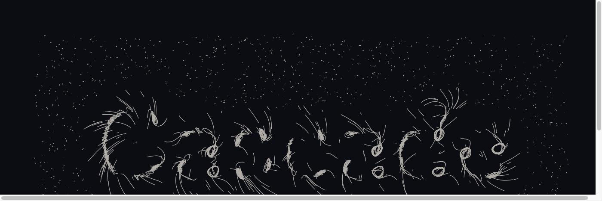

# particle-word

A word made of particle trails. Houdini's POP model, in six nodes.



## What it does

```
word-field → pop.Simulate → geo.SvgExport → core.Output
```

**`word-field`** renders the word to an offscreen canvas, **blurs it**, takes the gradient of the blurred image, and emits one point per cell carrying that gradient as `N`. The blur is the whole trick and it is worth understanding before turning anything: a hard letterform's gradient points at the nearest *edge*, so pulling up it pins particles to outlines. Blurred, each stroke becomes a ridge whose peak runs down its middle — so the gradient points at the **spine**, and its perpendicular runs **along** the outline.

**`cascade.pop.Simulate`** scatters particles in the area *around* the type, then drags them with two halves of that one field: `field_normal` pulls up the gradient toward the spine, `field_tangential` pushes along the perpendicular. Balance the two and the word forms out of curling strokes; take either away and you get a clump or a drift. It outputs the particles and their **trails**, one open polyline each.

**`cascade.geo.SvgExport`** writes the trails. About 2,500 short strokes.

### The two numbers that matter

`field_normal` against `field_tangential` is the balance, and it is delicate in both directions:

| | |
| --- | --- |
| tangential ≫ normal | vortices. Beautiful, and the word is gone |
| normal ≫ tangential | particles collapse onto the spine as points with radial spokes |
| roughly 3:2 | the word forms out of curling strokes |

`blur` interacts with it more than it looks. Too much and each letter merges into one blob whose ridge is a single peak, so the spine collapses to a point — which reads as the *forces* being wrong when it is the field. At this grid, 3 keeps each stroke its own ridge.

**Particles spawn in `birth_area`, around the type rather than on it.** Birthing them on the letterforms puts every particle where it is already going, so nothing travels and the field has nothing to reveal.

## Why the field is geometry and not an image

The effect this rebuilds reads a raster, so an `image` input was the obvious design and it was wrong for a *core* node: decoding an image needs a capability, the media capability returns a host-specific lease rather than a portable raster, and a POP node doing IO stops being the pure arithmetic that lets it cook identically in a browser and under the CLI.

So the rasterising stays in `word-field`, where a sketch's knowledge of type belongs, and what crosses the wire is points carrying `N` — a vector field in Cascade's existing vocabulary. Point anything else that can emit a gradient at the same input and the same simulation draws it.

## Things this sketch demonstrates

- **Re-simulation as the reference implementation.** `Simulate` takes a `frame` and replays every step from zero. It holds no state and reads no clock, so cooking the same frame twice is byte-identical — which is the property that makes a cache sound later, because the cache can then hold only what re-simulation would have produced anyway. Scrubbing is O(frame), and that is the honest cost.
- **Trails as geometry, not as a faded canvas.** The original of this technique draws to a persistent canvas and fades it 5.5% a frame. Trails as polylines are resolution-independent, print, and keep one feedback loop instead of two.
- **A hash instead of a PRNG.** Every random draw is a pure function of `(seed, id)`, so re-simulating gives the same particles rather than a similar-looking set.
- **`id` rather than an index.** A particle array reorders on every kill, so a trail joins its points by `id`. Joining by array position would draw a stroke from one particle to an unrelated one — a plausible tangle rather than an error.
- **A spatial index inside the force that needs it.** Attraction without one is `particles × targets`: about seven million distance checks a frame here, and the first render did not finish inside two minutes. With a grid, 1.7 seconds.

## Running it

```bash
npm install
npm run studio        # the editor, in a browser
npm run run           # writes the SVG into .cascade-cache
npm run check:graph
```

`cascade run --frames` reports that the graph has no image output — it writes an SVG rather than a raster, which the SVG node has already done by the time you see that message. Look in `.cascade-cache/`.

## Turning it

`text` on `word-field` is an input, so it can be driven; change it and the whole picture re-forms around the new word. `trail_length` is how much of each particle's history is drawn. `noise_amplitude` is there to keep the flow from being too orderly and wants to stay small — above about 20 it competes with the field rather than roughening it.
